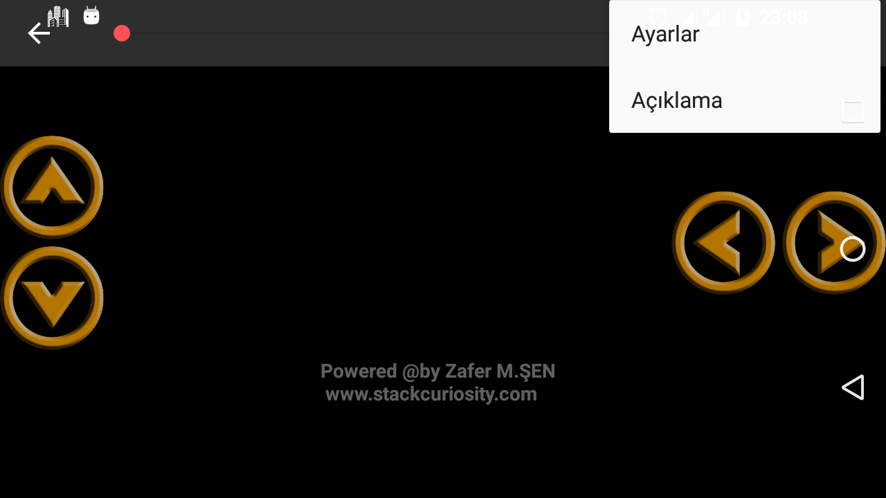
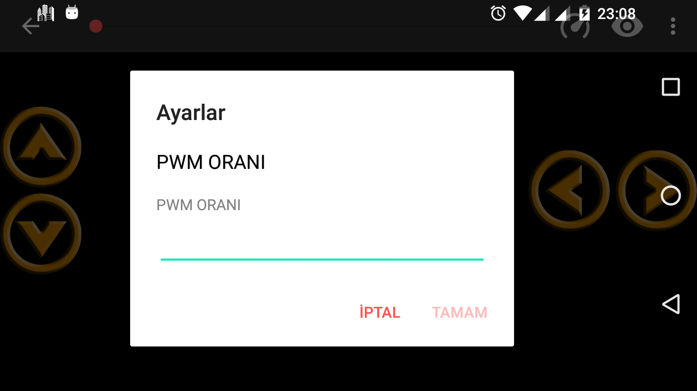
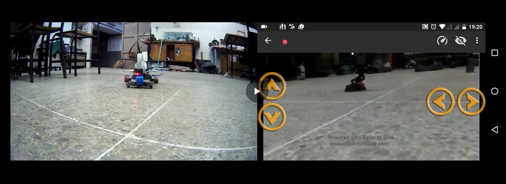

# RASPBERRY PI- ARDUINO ANDROID-CONTROLLED RC-CAR ROVER WITH LIVE VIDEO STREAMING

## About this project?

* Direction control via Android
* Video streaming from RC-Car to mobile phone simultaneously
* Follow Me (Very Soon)

## Materials
* Arduino Nano
* Raspberry Pi
* Raspberry Pi Camera Module
* L298N Motor Drive
* DC MOTOR X  2 
* 12V Lipo Battery
* Car Frame (Body)

## Arduino:
### PURPOSE AND TASKS:

*	Arduino was used for motor control.
* Arduino and Raspberry Pi were connected by serial communication.
* Before PWM signal interval which will be sent from Android phone to Arduino don't transfer, this signal was calculated. (Because of the next updates and easily interfere to PWM variable by users.)
* The Raspberry Pi provides the Wi-Fi communication with Arduino and the user (Android phone).
* In the following section, we show the circuit schematic for Raspberry Pi, Raspberry Pi Camera, Arduino, L298N Motor Driver, motors and batteries.
 

### SETTING UP ARDUINO AND PIN CONNECTION SCHEMATIC

* Data which come to Arduino is sent as a PWM interval that go to the motors directly. There are two values `+ (forward)` or `- (backward)` for decide direction with PWM value.
* Above-mentioned situations is considered by us, there can be made various modifications.
* PWM interval is between` 0-255.`
* RIGHT AND LEFT motor PWMs' and servo motor angle is taken as a String(e.g. `200:200!888`) from phone. This String value is splitted with `:` and `!` characters and created the array that has 3 elements.
* The value after the `!` character is the servo motor's angle value which connected with camera. Servo motor is not used in this project.
* Motor Moving, PWM data and situations of the car
* Example:
* 0:0 //stop
* 200:200 // move forward. (2 motors work with 200pwm)
* 200:-200 //move backward. (2 motors work with 200pwm)
* 200:-200 // left motor turns 200 pwm to forward, right motor turns 200 pwm to backward (The car turns its around from left to right.)
* 200:-200 // left motor turns 200 pwm to backward, right motor turns 200 pwm to forward (The car turns its around from right to left.)
* 200:100 // The car moves as turning to the right.  
 

  
* Connections among Arduino, Raspberry pi,Raspberry pi camera module, L298N motor driver, Motors and Power Supply are set up as above picture.
* After connected Arduino pins and Raspberry pi as above picture, we can load our codes to Arduino. That do by this sequence:
* Detail information about Arduino codes is placed in that codes.
* Download `androidToRaspberry.ino` file and open this file with double click.
* For uploading that project file to Arduino, first you must select the Arduino model from `Tools => Board` menu.  

  
* Again from `Tools` menu, you must show which port plugged to Arduino board. `Tools => port`
* After realize all steps, now you can upload the codes to Arduino board. You can complete the uploading process by pressing `Upload` button from left-up corner of the program.  

  

## RASPBERRY PI:
### PURPOSE AND MISSIONS:

* Taking video stream with Raspberry Pi camera module and trasfer that stream to phone via Raspberry pi.
* Connection between Arduino and Android phone.

### RASPBERRY PI SETUP:

We need some additional packages for can work our application. **These are;** 

**GSTREAMER1.0 :** 
After connect with SSH, we must type that in order: 

* 1.	Write `sudo nano /etc/apt/sources.list`
and press Enter. From coming screen; 

* 2.	 Write `deb http://vontaene.de/raspbian-updates/ . main`
command and exit the page with **CTRL + O  ==>  Y**   

* 3. Write 	`sudo apt-get update` and get latest updates.  

Then by turns, apply that steps:

* 4.	`sudo apt-get dist-upgrade`

* 5.	`sudo reboot`

* 6.	`sudo apt-get install gstreamer-1.0` 

* 7.	`sudo apt-get install gstreamer1.0-tools`

And after this steps, we installed gstreamer package.

**SETUP MAIN FILE:**

Now we install the main file of the application;

* 1. We are downloading our GitHub file in Raspberry pi terminal screen. `git clone https://github.com/zafersn/Wi-Fi-Gstreamer-Server.git`
      
* 2.	Also with "ls" command with control that file. The file which we downloaded is shown as a "Wi-Fi-Gstreamer-Server" name.

* 3.	`Write "cd Wi-Fi-Gstreamer-Server" and enter in the file. You can see with "ls" command a "robotcontrolV1.pyc" named python application.

* 4. We need to move this file with "sudo cp robotcontrolV1.pyc /home/pi" command to our "/home/pi" directory. If you can't do this, application is not working correctly. 

* 5.  In case of skip that steps successfully, we give our first start on the Raspberry Pi manually. Because, this is useful for us to see working this application.

* 6. Execute the application manually: execute the program with "sudo python robotcontrolV1.pyc" command in main terminal. If you are setting up until this step successfully, you must see "Client Baglantisi Bekleniyor..." print.

* 7. Last, you try to conncect from Android phone to Raspberry Pi via our application.

* 8. If we are execute our Python code (robotcontrolV1.pyc) in Raspberry Pi manually, our phone's IP and port informations will appear in the screen when we connect from Android.

 

## ANDROID:

### AMAÇ VE GÖREVLERİ:
* Raspberry pi ve arduino ile yapılmış olan rc-arabanın kontrolünü sağlamak.
* Kullanıcı için sade ve kolay görsel arayüz.
* Raspberry pi üzerinden kamera görüntüsünü alarak kullanıcıya göstermek.

### ANDROID UYGULAMA KURULUMU:
* Aracın kontrolü için iki adet uygulama mevcuttur.Bunlar demo ve pro sürümleridir.Demo ve Pro sürümleri arasında uygulamada kullanılan özellikler bakımından hiç bir fark yoktur.Sadece demo sürümde uygulamanın kullanım adeti sınırlaması bulunmaktadır.Bu kullanım adedi minimum 30 adet olarak belirlenmiş olup admin tarafından attırılabilir ve ya azaltılabilir.(Not: Uygulamanın kullanım adedinin hesaplanmasında uygulamaya girdi-çıktı sayısına göre değil, Aracın android uygulama tarafından başarılı bir şekilde  kontrol edilmesi,bağlanılması durumu kullanılır.Bu durumda kullanım adedinin artması için sistemin bir bütün olarak çalışması gerekmektedir.Gönül rahatlığıyla uygulama indirilebilir ve sistem ücretsiz olarak kullanılabilir.)
* Yukarıdaki durum göz önüne alındığında gerekli uygulamanın kurulumu son derece basittir. Sadece yapılması gereken **ANDROID GOOGLE PLAY** markette giriş yapıldıktan sonra arama kutucuğuna, uygulamaya doğrudan erişmek için `com.stackcuriosity.tooght` ve ya uygulama ismi `Wifi RC Controoller with Camera` yazmanız yeterlidir.

### UYGULAMA KULLANIMI VE İPUCULARI
#### Raspberry pi bağlantı bilgileri
* Uygulamamız ilk açıldığında aşağıdaki gibi bir giriş erkranı kullanıcıyı karşılamaktadır.Bu ekran' da yapmanız gereken raspberry pi' nizin bağlı bulunduğu Wi-Fi ağdaki bilgilerinin girilmesi.  

* Örnek bir raspberry pi bilgileri girilmiş şekli   
* Bu bilgileri başarı ile girildiğinde aşağıdaki kontrol arayüzünün sizi karşılaması gerekmektedir.  
* Eğer raspberry pi' nize herhangi bir nedenden dolayı kontrol ekranına ulaşamazsanız ve aşağıdaki resimdeki gibi `Balantı başarısız. Lütfen tekrar deneyiniz.` hatasını alıyor iseniz.Lütfen raspberry pi bağlantı ayarlarınızı,bağlantı bilgilerinizi kontrol ediniz.Çünkü bu hatanın sebebi, telefonun raspberry pi' de oluşturduğumuz ve çalıştırdığımız `robotcontrolV1.pyc` bağlanamamasından ötürüdür. 
* Bu hatanın çözümü için `Raspberry Pi ANA KURULUM` bölümünde anlatılan adımların tekrar gözden geçirmeniz ve kurulumu kontrol etmeniz gerekmektedir.

#### UYGULAMA DETAYLARI

##### 1. GÖRSEL ARAYÜZÜN AÇIKLANMASI VE PROGRAMLAMA MANTIĞI
* Uygulamamız 3 temel esasa dayanmaktadır. Bunlar;
*  1. Aracın yön kontrolünün sağlanması.
*  2. Kullanıcıya araç üzerindeki kameradan canlı görüntünün aktarılması.
*  3. Fallow Me (Çok yakında).(Aracın sahibini takip etmesi). 
*  Bu üç temel esasa göre 
*  1. Aracın yön kontrolünde kullanılan mantığın ana detaylarını `Arduino` bölümde anlattık.Android tarafına bakan kısmı ile açıklayacak olursak.Android tarafında, kullanıcı için `Seek bar (Hız ayarı)` ve `Yön tuşları` mevcuttur.   
*  **Seek bar(Hız ayarı)** 15 dilimden oluşmaktadır ve hız katsayısı 17'dir.Yani seek bar' ın herbir hareketi pwm'de 17'nin katları şeklinde bir oynama yapmaktadır.Seek bar 5. kademede ise üretilen pwm= 5*17 = 85 'tir.
*  **Yön tuşları** seek bar(Hız ayarı)'dan alınan verinin yönlere ayrılmasını sağlar. Aracın gidiş yönüne göre pwm değerinin başına + ve ya - işareti getirilir. Örn;
* * 200:200     // ileri git. ( 2 motorda 200pwm ile çalışır )
*  -200:-200   //geri git. (2 motorda 200pwm ile çalışır)
*  200:-200   // sol motor 200 pwm ileri, sag motor 200 geri döner ( araç kendi etrafında soldan sağa doğru döner)
* -200:200   // sol motor 200 pwm geri, sag motor 200 ileri döner ( araç kendi etrafında sağdan sola doğru döner)
* 200:100    // araç sağa dönecek şekilde hareket eder.   

##### 2.SAĞ'A VE SOL'A DÖNÜŞLERDE HASSASİYET
* Aracımızın sağ çağraz ve sol çapraz hareketleri yaparken dönüş yapılacak taraftaki motorların pwm değerleri düşürülür ve böylece motorların daha yavaş dönmesi sağlanır.Bu sayede araç istenilen hassasiyette çarpraz dönüşleri gerçekleştirebilir.**Bu dönüş hareketlerinin hassasiyet ayarlaması kullanıcıya bırakılmıştır.**
* Çapraz dönüşlerin hassasiyetinin hesaplanmasında kullanılan formül : **`PWM DEĞERİ - (PWM DEĞERİ / PWM ORANI)`** 'dır.
* PWM ORANI varsayılan olarak `2` gelmektedir.
* PWM ORANI ayarını, kontrol ekranın da sağ üst köşede ayarlar butonundan tekrar ayarlar sekmesine basarak ulaşabilirsiniz.   
* Girebileceğinz PWM ORANI aralığı **minimum ve maksimum olarak 1-4 arasında integer ve double tipinde** değerlerdir.
 

### UYGULAMA ICON 'UMUZ:

## TEST VİDEO:

