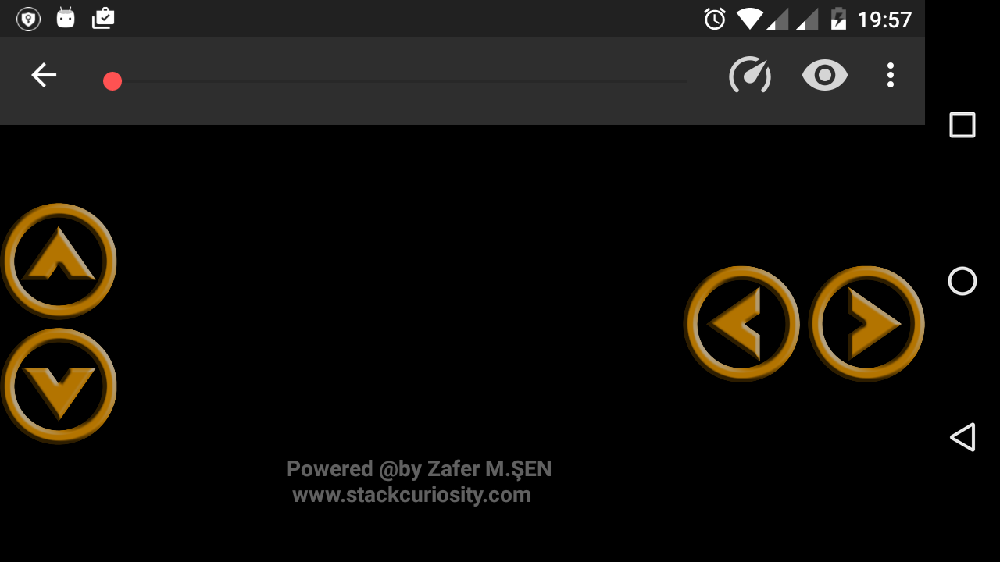
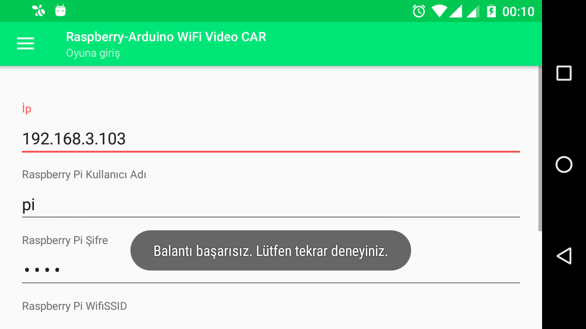
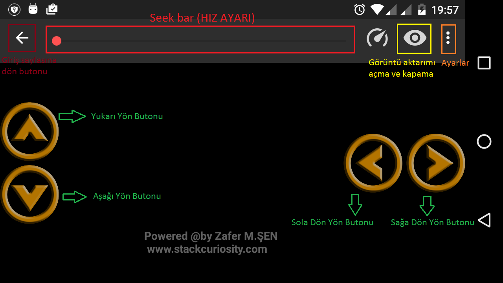

# RASPBERRY PI- ARDUINO ANDROID-CONTROLLED RC-CAR ROVER WITH LIVE VIDEO STREAMING

## PROJE NEDİR?

* Android üzerinden yön kontrolü
* Telefona, araçtan eş zamanlı görüntü aktarımı
* Fallow Me (Çok yakında)

## Kullanılan Malzemeler
* Arduino Nano
* Raspberry Pi
* Raspberry Pi Camera Modülü
* L298N Motor Sürücü
* DC MOTOR X  2 
* 12V Lipo Batarya
* Araç Şasi (Gövdesi)

## Arduino:
### AMAÇ VE GÖREVLER:
*	Arduino motorları kontrol etmek amacı ile kullanılmıştır.
*	Arduino ile raspberry pi usb üzerinden seri haberleşme yapmaktadır.
*	Android telefonumuz üzerinde arduino’ya gidecek olan pwm aralığı hesaplanıp gönderilmektedir.(Gelecek güncellemeler ve kullanıcının pwm değişkenine daha kolay müdahale edilmesi için)
*	Raspberry pi arduino ile kullanıcının(Android telefonun) Wi-Fi haberleşmesini sağlamaktadır.
*	Aşağıda Raspberry pi, Raspberry pi Camera, Arduino, L298N Motor Sürücü,Motorlar ve Bataryanın devre bağlantı şeması gösterilmiştir. 

 
### ARDUINO KURULUMU VE PIN BAĞLANTI ŞEMASI

* Arduino 'ya gelen veri doğrudan motorlara gidecek pwm aralığı olarak gelmektedir.PWM değerinin yanında sadece aracın yön tayini için ` + (ileri)` ve ya `- (geri)` değerini almaktadır.
* Yukarıdaki durum göz önüne alınarak çeşitli modifikasyonlar yapılabilir.
* PWM aralığı `0-255` arasındadır.
* Telefon üzerinden SAĞ VE SOL motor pwmlerini ve servo motor açısını String bir şekilde örn:  200:200!888 şeklinde alıyoruz. Aradaki iki nokta üst üste  `:` ve ünlem işareti `!` ' e göre bölerek 3 elemanlı bir dizi oluşturuyoruz.
*  `!` den sonraki değer, cameranın bağlı bulunduğu servo motor'un açı değerleridir. Bu çalışmada servo motor kullanılmamıştır.  
**Motor Hareket PWM Geliş Tipi ve Aracın Durumları** 
örn:
*  0:0      //stop
* 200:200     // ileri git. ( 2 motorda 200pwm ile çalışır )
*  -200:-200   //geri git. (2 motorda 200pwm ile çalışır)
*  200:-200   // sol motor 200 pwm ileri, sag motor 200 geri döner ( araç kendi etrafında soldan sağa doğru döner)
* -200:200   // sol motor 200 pwm geri, sag motor 200 ileri döner ( araç kendi etrafında sağdan sola doğru döner)
* 200:100    // araç sağa dönecek şekilde hareket eder.  
 

  
* Arduino, Raspberry pi,Raspberry pi camera modülü, L298N motor sürücü, Motorlar, Güç kaynağının bağlantılarını  yukarıdaki resimdeki gibi gerçekleştiriniz.
* Yukarıdaki şekildeki gibi arduino pin bağlantılarını ve raspberry pi bağlantısını  gerçekleştirdikten sonra yapmamız gereken arduino kodlarımızı yüklemek olacaktır. 
**Bunu sıra ile şu  şekilde yapabilirsiniz. **

**I.** Arduino kodlarının açıklamaları ve ne işe yaradığı ile ilgili detaylı bilgi kodların içinde mevcuttur. 

**II.** `androidToRaspberry.ino` adlı arduino kodumuzu indiriniz ve çift tıklayarak açınız. 

**III.** Açılan proje dosyasını arduino' ya yüklemek için sıra ile  sekmelerden `Tools` => `Board`  ve buradan kullandığınız arduino modelinizi seçiniz.  

  
**IV.** Tekrar `Tools` sekmesinden takmış olduğunuz arduino' nuzun hangi port' a takılı olduğunu gösteriniz.  `Tools` => `port` 

**V.** Yukarıdaki adımları gerçekleştirdikten sonra şimdi programımızı arduino' muza yükleyebiliriz.Sol üst köşede `Upload` butonuna basarak yükleme işlemini tamamlamış oluyoruz.  

  

## RASPBERRY PI:
### AMAÇ VE GÖREVLER:

* Raspberry pi camera modülü kullanarak görüntünün alınması ve raspberry pi üzerinden telefona aktarılması.
* Arduino ve Telefon arasında bağlantının kurulması.

### RASPBERRY PI KURULUMU:

Uygulamamızın çalışabilmesi için raspberry pi üzerinde bazı ek paketlerin kurulması gerekmektedir. **Bunlar ;** 

**GSTREAMER1.0 :** 
SSH ile bağlandıktan sonra terminal ekranından sıra ile ; 

**I.**	`sudo nano /etc/apt/sources.list`  
Yazıp enter’a basınız. Açılan ekranda  

**II.**	`deb http://vontaene.de/raspbian-updates/ . main`  
Komutunu yazınız ve **CTRL + O  ==>  Y** diyerek sayfadan ayrılınız.   

**III.**	`sudo apt-get update`  
  

Diyerek en son güncelemeyi alınız.Daha sonra aşağıdaki adımları sıra ile uygulayınız.  

**IV.**	`sudo apt-get dist-upgrade`  

**V.**	`sudo reboot`  

**VI.**	`sudo apt-get install gstreamer-1.0`    

**VII.**	`sudo apt-get install gstreamer1.0-tools`  

Ve bu adımlar sonrasında başarı ile gstreamer paketini kurmuş olduk.

**ANA DOSYA KURULUMU:**

Şimdi uygulamanın ana dosyasının kurulumunu yapalım;

*  Raspberry pi terminal ekranında githup dosyamızı indiriyoruz. `git clone https://github.com/zafersn/Wi-Fi-Gstreamer-Server.git`
      
* 	Terminal ekranın da `ls` komutu ile kontrol ediyoruz.İndirdiğimiz dosya `Wi-Fi-Gstreamer-Server ` adı ile inecektir.

* 	` cd Wi-Fi-Gstreamer-Server ` diyerek bu dosyanın içine giriyoruz. Burada `ls` diyerek `robotcontrolV1.pyc` adında python uygulamamız görünecektir.

* 	`robotcontrolV1.pyc` dosyamızı `sudo cp robotcontrolV1.pyc /home/pi` diyerek mutlaka dosyamızı `/home/pi` dizinine taşımamız gerekmektedir. Aksi taktirde telefon uygulamasından bağlanılamayacaktır. 

*  Bu aşamaların başarıyla gerçekleşmesi durumunda uygulamamızın ilk startı raspberry pi üzerinde manuel olarak verelim.Çünkü buraya kadar çalıştığını görmemiz faydalı olacaktır.

*  Uygulamayı manuel olarak  çalıştırmak için ; Ana terminal üzerinde `sudo python robotcontrolV1.pyc` diyerek programı çalıştırınız.Eyer programı başarılı bir şekilde kurdu iseniz ekranda `Client Baglantisi Bekleniyor...` çıktısı görmelisiniz.

*  Son olarak Android telefonunuz üzerinden uygulamamız aracılığı raspberry pi 'ye bağlanmayı deneyiniz.

*  Eğer raspberry pi üzerinde ki python kodumuzu (`robotcontrolV1.pyc`) manuel olarak çalıştırmış isek  android üzerinden bağlantıyı gerçekleştirdiğimizde telefonumuzun ip ve port bilgileri ekran da gözükecektir.

 

## ANDROID:

### AMAÇ VE GÖREVLERİ:
* Raspberry pi ve arduino ile yapılmış olan rc-arabanın kontrolünü sağlamak.
* Kullanıcı için sade ve kolay görsel arayüz.
* Raspberry pi üzerinden kamera görüntüsünü alarak kullanıcıya göstermek.

### ANDROID UYGULAMA KURULUMU:
* Aracın kontrolü için iki adet uygulama mevcuttur.Bunlar demo ve pro sürümleridir.Demo ve Pro sürümleri arasında uygulamada kullanılan özellikler bakımından hiç bir fark yoktur.Sadece demo sürümde uygulamanın kullanım adeti sınırlaması bulunmaktadır.Bu kullanım adedi minimum 30 adet olarak belirlenmiş olup admin tarafından attırılabilir ve ya azaltılabilir.(Not: Uygulamanın kullanım adedinin hesaplanmasında uygulamaya girdi-çıktı sayısına göre değil, Aracın android uygulama tarafından başarılı bir şekilde  kontrol edilmesi,bağlanılması durumu kullanılır.Bu durumda kullanım adedinin artması için sistemin bir bütün olarak çalışması gerekmektedir.Gönül rahatlığıyla uygulama indirilebilir ve sistem ücretsiz olarak kullanılabilir.)
* Yukarıdaki durum göz önüne alındığında gerekli uygulamanın kurulumu son derece basittir. Sadece yapılması gereken **ANDROID GOOGLE PLAY** markette giriş yapıldıktan sonra arama kutucuğuna, uygulamaya doğrudan erişmek için `com.stackcuriosity.tooght` ve ya uygulama ismi `RC CONTROLLER WITH CAMERA` yazmanız yeterlidir.

### UYGULAMA KULLANIMI VE İPUCULARI
#### Raspberry pi bağlantı bilgileri
* Uygulamamız ilk açıldığında aşağıdaki gibi bir giriş erkranı kullanıcıyı karşılamaktadır.Bu ekran' da yapmanız gereken raspberry pi' nizin bağlı bulunduğu Wi-Fi ağdaki bilgilerinin girilmesi.  

* Örnek bir raspberry pi bilgileri girilmiş şekli   
* Bu bilgileri başarı ile girildiğinde aşağıdaki kontrol arayüzünün sizi karşılaması gerekmektedir.  
* Eğer raspberry pi' nize herhangi bir nedenden dolayı kontrol ekranına ulaşamazsanız ve aşağıdaki resimdeki gibi `Balantı başarısız. Lütfen tekrar deneyiniz.` hatasını alıyor iseniz.Lütfen raspberry pi bağlantı ayarlarınızı,bağlantı bilgilerinizi kontrol ediniz.Çünkü bu hatanın sebebi, telefonun raspberry pi' de oluşturduğumuz ve çalıştırdığımız `robotcontrolV1.pyc` bağlanamamasından ötürüdür. 
* Bu hatanın çözümü için `Raspberry Pi ANA KURULUM` bölümünde anlatılan adımların tekrar gözden geçirmeniz ve kurulumu kontrol etmeniz gerekmektedir.

#### UYGULAMA DETAYLARI

##### 1. GÖRSEL ARAYÜZÜN AÇIKLANMASI VE PROGRAMLAMA MANTIĞI
* **Uygulamamız 3 temel esasa dayanmaktadır.** Bunlar;
  1. Aracın yön kontrolünün sağlanması. 
  2. Kullanıcıya araç üzerindeki kameradan canlı görüntünün aktarılması. 
  3. Fallow Me (Çok yakında).(Aracın sahibini takip etmesi). 
* Bu üç temel esasa göre 
*  Aracın yön kontrolünde kullanılan mantığın ana detaylarını `Arduino` bölümde anlattık.Android tarafına bakan kısmı ile açıklayacak olursak.Android tarafında, kullanıcı için `Seek bar (Hız ayarı)` ve `Yön tuşları` mevcuttur.   
*  **Seek bar(Hız ayarı)** 15 dilimden oluşmaktadır ve hız katsayısı 17'dir.Yani seek bar' ın herbir hareketi pwm'de 17'nin katları şeklinde bir oynama yapmaktadır.Seek bar 5. kademede ise üretilen pwm= 5*17 = 85 'tir.
*  **Yön tuşları** seek bar(Hız ayarı)'dan alınan verinin yönlere ayrılmasını sağlar. Aracın gidiş yönüne göre pwm değerinin başına `+` ve ya `-` işareti getirilir. **Örn;**  
 200:200     // ileri git. ( 2 motorda 200pwm ile çalışır ) 
 -200:-200   //geri git. (2 motorda 200pwm ile çalışır) 
 200:-200   // sol motor 200 pwm ileri, sag motor 200 geri döner ( araç kendi etrafında soldan sağa doğru döner) 
 -200:200   // sol motor 200 pwm geri, sag motor 200 ileri döner ( araç kendi etrafında sağdan sola doğru döner) 
 200:100    // araç sağa dönecek şekilde hareket eder.   

##### 2.SAĞ'A VE SOL'A DÖNÜŞLERDE HASSASİYET
* Aracımızın sağ çağraz ve sol çapraz hareketleri yaparken dönüş yapılacak taraftaki motorların pwm değerleri düşürülür ve böylece motorların daha yavaş dönmesi sağlanır.Bu sayede araç istenilen hassasiyette çarpraz dönüşleri gerçekleştirebilir.**Bu dönüş hareketlerinin hassasiyet ayarlaması kullanıcıya bırakılmıştır.**
* Çapraz dönüşlerin hassasiyetinin hesaplanmasında kullanılan formül : **`PWM DEĞERİ - (PWM DEĞERİ / PWM ORANI)`** 'dır.
* PWM ORANI varsayılan olarak `2` gelmektedir.
* PWM ORANI ayarını, kontrol ekranın da sağ üst köşede `Ayarlar` butonundan tekrar `Ayarlar` sekmesine basarak ulaşabilirsiniz.    
* Girebileceğinz PWM ORANI aralığı **minimum ve maksimum olarak 1-4 arasında integer ve double tipinde** değerlerdir.
 

### UYGULAMA ICON 'UMUZ:

## TEST VİDEO:

