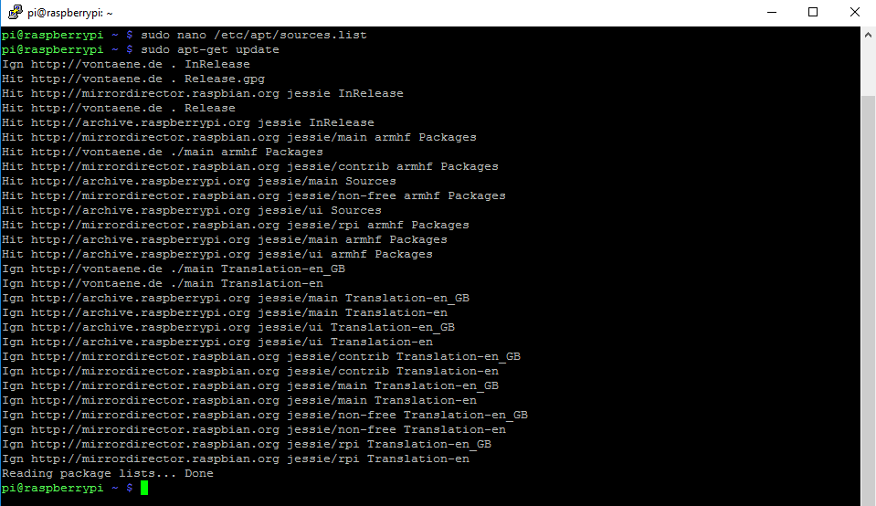
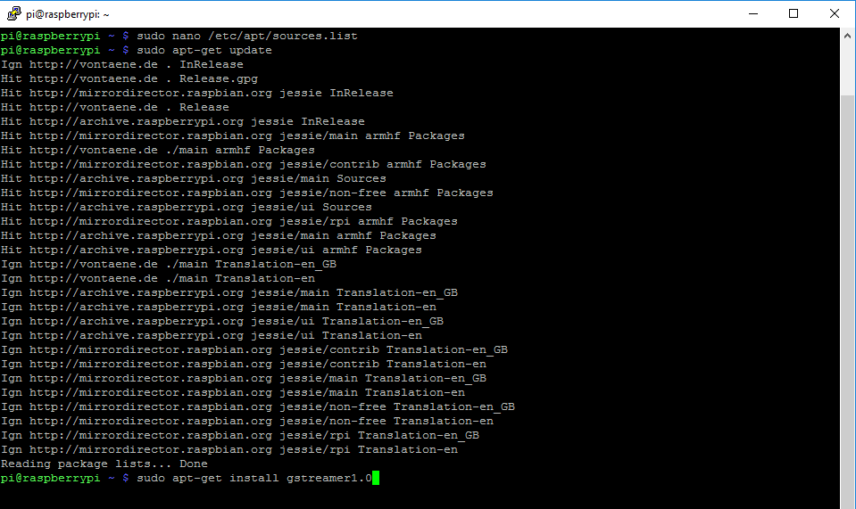
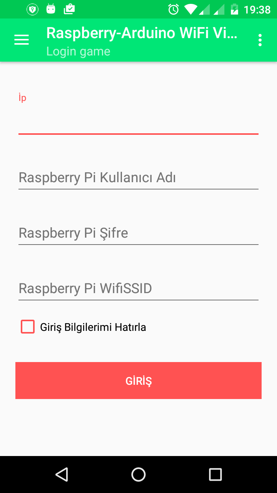
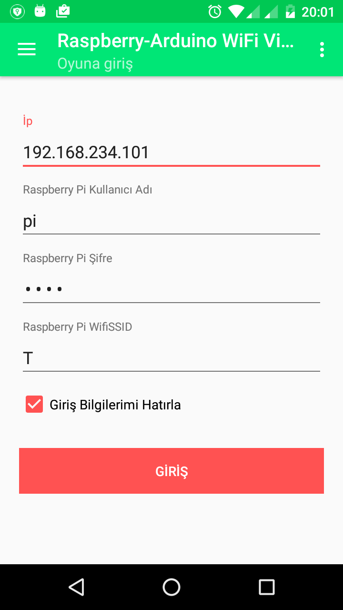

# RASPBERRY PI- ARDUINO ANDROID-CONTROLLED RC-CAR ROVER WITH LIVE VIDEO STREAMING

## PROJE NEDİR?

* Android üzerinden yön kontrolü
* Telefona, araçtan eş zamanlı görüntü aktarımı
* Fallow Me (Çok yakında)

## Kullanılan Malzemeler
* Arduino Nano
* Raspberry Pi
* Raspberry Pi Camera Modülü
* L298N Motor Sürücü
* DC MOTOR X  2 
* 12V Lipo Batarya
* Araç Şasi (Gövdesi)

## Arduino:
### AMAÇ VE GÖREVLER:
*	Arduino motorları kontrol etmek amacı ile kullanılmıştır.
*	Arduino ile raspberry pi usb üzerinden seri haberleşme yapmaktadır.
*	Android telefonumuz üzerinde arduino’ya gidecek olan pwm aralığı hesaplanıp gönderilmektedir.(Gelecek güncellemeler ve kullanıcının pwm değişkenine daha kolay müdahale edilmesi için)
*	Raspberry pi arduino ile kullanıcının(Android telefonun) Wi-Fi haberleşmesini sağlamaktadır.
*	Aşağıda Raspberry pi, Raspberry pi Camera, Arduino, L298N Motor Sürücü,Motorlar ve Bataryanın devre bağlantı şeması gösterilmiştir. 

### ARDUINO KURULUMU VE PIN BAĞLANTI ŞEMASI

* Arduino 'ya gelen veri doğrudan motorlara gidecek pwm aralığı olarak gelmektedir.Sadece aracın yön tayini için ` + (ileri)` ve ya `- (geri)` değerini almaktadır.
* Yukarıdaki durum göz önüne alınarak çeşitli modifikasyonlar yapılabilir.
* PWM aralığı `0-255` arasındadır.
* Telefon üzerinden SAĞ VE SOL motor pwmlerini ve servo motor açısını String bir şekilde örn:  200:200!888 şeklinde alıyoruz. Aradaki iki nokta üst üste  `:` ve ünlem işareti `!` ' e göre bölerek 3 elemanlı bir dizi oluşturuyoruz.
*  `!` den sonraki değer, cameranın bağlı bulunduğu servo motor'un açı değerleridir. Bu çalışmada servo motor kullanılmamıştır.
* Motor Hareket PWM geliş tipi ve arcın durumları
* örn:
*  0:0      //stop
* 200:200     // ileri git. ( 2 motorda 200pwm ile çalışır )
*  -200:-200   //geri git. (2 motorda 200pwm ile çalışır)
*  200:-200   // sol motor 200 pwm ileri, sag motor 200 geri döner ( araç kendi etrafında soldan sağa doğru döner)
* -200:200   // sol motor 200 pwm geri, sag motor 200 ileri döner ( araç kendi etrafında sağdan sola doğru döner)
* 200:100    // araç sağa dönecek şekilde hareket eder.  
 

  
* Arduino, Raspberry pi,Raspberry pi camera modülü, L298N motor sürücü, Motorlar, Güç kaynağının bağlantılarını  yukarıdaki resimdeki gibi gerçekleştiriniz.
* Yukarıdaki şekildeki gibi arduino pin bağlantılarını ve raspberry pi bağlantısını  gerçekleştirdikten sonra yapmamız gereken arduino kodlarımızı yüklemek olacaktır.
Bunu sıra ile şu  şekilde yapabilirsiniz.

* 0. Arduino kodlarının açıklamaları ve ne işe yaradığı ile ilgili detaylı bilgi kodların içinde mevcuttur.

* 1. `androidToRaspberry.ino` adlı arduino kodumuzu indiriniz ve çift tıklayarak açınız.

* 2. Açılan proje dosyasını arduino' ya yüklemek için sıra ile  sekmelerden `Tools` => `Board`  ve buradan kullandığınız arduino modelinizi seçiniz.  

  
* 3. Tekrar `Tools` sekmesinden takmış olduğunuz arduino' nuzun hangi port' a takılı olduğunu gösteriniz.  `Tools` => `port`

* 4. Yukarıdaki adımları gerçekleştirdikten sonra şimdi programımızı arduino' muza yükleyebiliriz.Sol üst köşede `Upload` butonuna basarak yükleme işlemini tamamlamış oluyoruz.  

  

## RASPBERRY PI:
### AMAÇ VE GÖREVLER:

* Raspberry pi camera modülü kullanarak görüntünün alınması ve raspberry pi üzerinden telefona aktarılması.
* Arduino ve Telefon arasında bağlantının kurulması.

### RASPBERRY PI KURULUMU:

Uygulamamızın çalışabilmesi için raspberry pi üzerinde bazı ek paketlerin kurulması gerekmektedir. **Bunlar ;** 

**GSTREAMER1.0 :** 
SSH ile bağlandıktan sonra terminal ekranından sıra ile ; 

* 1.	`sudo nano /etc/apt/sources.list`
Yazıp enter’a basınız. Açılan ekranda 

* 2.	`deb http://vontaene.de/raspbian-updates/ . main`
Komutunu yazınız ve **CTRL + O  ==>  Y** diyerek sayfadan ayrılınız.  

* 3.	`sudo apt-get update` 

Diyerek en son güncelemeyi alınız.Daha sonra aşağıdaki adımları sıra ile uygulayınız.

* 4.	`sudo apt-get dist-upgrade`

* 5.	`sudo reboot`

* 6.	`sudo apt-get install gstreamer-1.0` 

* 7.	`sudo apt-get install gstreamer1.0-tools`

Ve bu adımlar sonrasında başarı ile gstreamer paketini kurmuş olduk.

**ANA DOSYA KURULUMU:**

Şimdi uygulamanın ana dosyasının kurulumunu yapalım;

* 1. Raspberry pi terminal ekranında githup dosyamızı indiriyoruz. `git clone https://github.com/zafersn/Wi-Fi-Gstreamer-Server.git`
      
* 2.	Terminal ekranın da `ls` komutu ile kontrol ediyoruz.İndirdiğimiz dosya `Wi-Fi-Gstreamer-Server ` adı ile inecektir.

* 3.	` cd Wi-Fi-Gstreamer-Server ` diyerek bu dosyanın içine giriyoruz. Burada `ls` diyerek `robotcontrolV1.pyc` adında python uygulamamız görünecektir.

* 4.	`robotcontrolV1.pyc` dosyamızı `sudo cp robotcontrolV1.pyc /home/pi` diyerek mutlaka dosyamızı `/home/pi` dizinine taşımamız gerekmektedir. Aksi taktirde telefon uygulamasından bağlanılamayacaktır. 

* 5. Bu aşamaların başarıyla gerçekleşmesi durumunda uygulamamızın ilk startı raspberry pi üzerinde manuel olarak verelim.Çünkü buraya kadar çalıştığını görmemiz faydalı olacaktır.

* 6. Uygulamayı manuel olarak  çalıştırmak için ; Ana terminal üzerinde `sudo python robotcontrolV1.pyc` diyerek programı çalıştırınız.Eyer programı başarılı bir şekilde kurdu iseniz ekranda `Client Baglantisi Bekleniyor...` çıktısı görmelisiniz.

* 7. Son olarak Android telefonunuz üzerinden uygulamamız aracılığı raspberry pi 'ye bağlanmayı deneyiniz.

* 8. Eğer raspberry pi üzerinde ki python kodumuzu (`robotcontrolV1.pyc`) manuel olarak çalıştırmış isek  android üzerinden bağlantıyı gerçekleştirdiğimizde telefonumuzun ip ve port bilgileri ekran da gözükecektir.

 

## ANDROID:

### AMAÇ VE GÖREVLERİ:
* Raspberry pi ve arduino ile yapılmış olan rc-arabanın kontrolünü sağlamak.
* Kullanıcı için sade ve kolay görsel arayüz.
* Raspberry pi üzerinden kamera görüntüsünü alarak kullanıcıya göstermek.

### ANDROID UYGULAMA KURULUMU:
Aracın kontrolü için gerekli uygulamanın kurulumu son derece basittir. Sadece yapılması gereken **ANDROID GOOGLE PLAY** markette giriş yapıldıktan sonra arama kutucuğuna, uygulamaya doğrudan erişmek için `com.stackcuriosity.tooght` ve ya uygulama ismi `Wifi RC Controoller with Camera` yazmanız yeterlidir.

### UYGULAMA KULLANIMI VE İPUCULARI
#### Raspberry pi bağlantı bilgileri
* Uygulamamız ilk açıldığında aşağıdaki gibi bir giriş erkranı kullanıcıyı karşılamaktadır.Bu ekran' da yapmanız gereken raspberry pi' nizin bağlı bulunduğu Wi-Fi ağdaki bilgilerinin girilmesi.  

* Örnek bir raspberry pi bilgileri girilmiş şekli 
* Bu bilgileri başarı ile girildiğinde aşağıdaki kontrol arayüzünün sizi karşılaması gerekmektedir. 
* Eğer raspberry pi' nize herhangi bir nedenden dolayı kontrol ekranına ulaşamazsanız ve aşağıdaki resimdeki gibi `Balantı başarısız. Lütfen tekrar deneyiniz.` hatasını alıyor iseniz.Lütfen raspberry pi bağlantı ayarlarınızı,bağlantı bilgilerinizi kontrol ediniz.Çünkü bu hatanın sebebi, telefonun raspberry pi' de oluşturduğumuz ve çalıştırdığımız `robotcontrolV1.pyc` bağlanamamasından ötürüdür. 
* Bu hatanın çözümü için Raspberry Pi ANA KURULUM bölümünde anlatılan adımların tekrar gözden geçirmeniz ve kurulumu kontrol etmeniz.

### UYGULAMA ICON 'UMUZ:

## TEST VİDEO:

